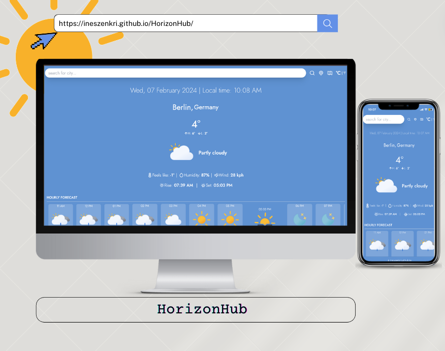

<h1 align="center">🌦️ HorizonHub</h1>

## 🚀 Features

- **Search Functionality**: As users type in the search bar, the autocomplete feature suggests relevant city names based on the input, making it easier for users to find the desired location quickly.
- **Geolocation**: The application supports geolocation to fetch the user's current location and display weather information accordingly.
- **Hourly Forecast**: Detailed hourly forecasts are provided, including weather icons, temperature, and sunrise/sunset times.
- **Daily Forecast**: Daily forecasts include weather icons, maximum and minimum temperatures, humidity, and wind speed.
- **Temperature Unit Toggle**: Users can switch between Celsius and Fahrenheit temperature units.
- **Interactive Map**: Users can click on the map to select a location for weather information.

- - - 

## 🔧 Dependencies

- React.js: A JavaScript library for building user interfaces.
- Leaflet: An open-source JavaScript library for interactive maps.
- Luxon: A library for working with dates and times in JavaScript.
- react-unicons: A library of pixel-perfect SVG icons for React applications.
- WeatherAPI: Provides current weather data, forecasts, and other weather-related information.
- Geoapify Autocomplete API: Powers the autocomplete feature in the search functionality.

- - -

## 🎨 Credits

- Icons provided by [Unicons](https://iconscout.com/unicons).

## 📸 Looks Like

### Webpage Screenshot

### Demo GIF

## 🚀 Live Demo

Check out the live demo of the HorizonHub weather application [here](https://ineszenkri.github.io/HorizonHub/).

## 💡 Ideas and Contributions

Contributions, ideas, and feedback are welcome!
Feel free to open an issue to discuss ideas or report any bugs you encounter.  Let's work together to make this project even better!
